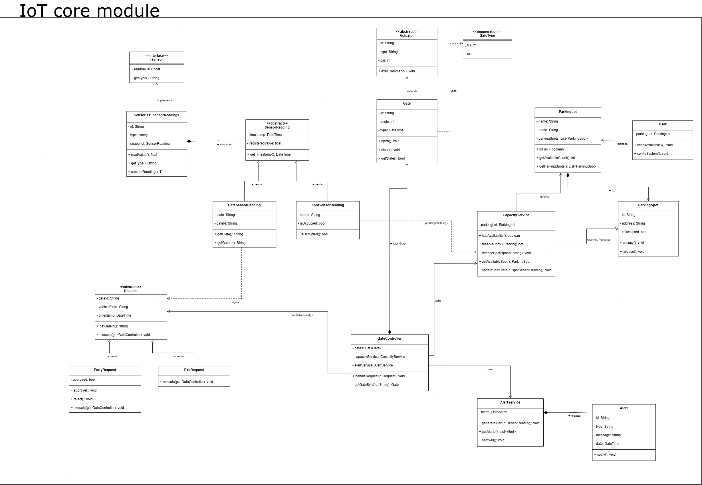

# Smart Parking Lot

A smart parking lot entry simulator built with **C# 14 / .NET 10**. This project has an **educational software design** focus and applies **GRASP** principles and patterns (General Responsibility Assignment Software Patterns).

## Objective

Demonstrate how GRASP principles guide responsibility assignment in a real object-oriented system, using vehicle access control in a parking lot as the use case.

## Applied GRASP Principles


| Principle              | Where it is applied                                                                         |
| ---------------------- | ------------------------------------------------------------------------------------------- |
| **Information Expert** | `ParkingLot` manages its spots; `ParkingSpot` knows its own state                           |
| **Controller**         | `GateController` receives the system event (entry request) and orchestrates the response    |
| **Low Coupling**       | Controllers depend on interfaces (`ICapacityService`), not concrete classes                 |
| **High Cohesion**      | Each class has one clearly defined responsibility                                           |
| **Creator**            | `Program.cs` as Composition Root assembles all dependencies                                 |

## Architecture

The solution is split into **4 projects** following Clean Architecture principles, with the Dependency Inversion Principle (DIP) ensuring that high-level modules depend on abstractions defined in Core:

```
src/
├── Core/                        # SmartParkingLot.Core — Zero dependencies
│   ├── Entities/                #   ParkingLot, ParkingSpot
│   ├── Ports/                   #   Interfaces: IGate, ISensor, ICapacityService,
│   │                            #   IAlertService, IGateRequestHandler
│   ├── Requests/                #   Request, EntryRequest, ExitRequest
│   ├── Readings/                #   SensorReading, GateSensorReading, SpotSensorReading
│   ├── Enums/                   #   GateType, ParkingMode
│   ├── Alert.cs, User.cs, Constants.cs
│
├── Application/                 # SmartParkingLot.Application → Core
│   ├── Controllers/             #   GateController (implements IGateRequestHandler)
│   └── Services/                #   CapacityService, AlertService
│
├── Hardware/                    # SmartParkingLot.Hardware → Core
│   ├── Actuator.cs              #   Abstract base for IoT actuators
│   ├── Gate.cs                  #   Physical gate (implements IGate)
│   └── Sensor.cs                #   Generic sensor (implements ISensor)
│
└── Cli/                         # SmartParkingLot.Cli → Core, Application, Hardware
    └── Program.cs               #   Composition Root (manual DI, top-level statements)
```

### Dependency Graph

```
         Cli (Composition Root)
        / |          \
       v  v           v
Application  Hardware  (Future: Desktop)
       \      /
        v    v
         Core
```

- `Core` has **zero** external dependencies — it is the pure domain model.
- `Application` and `Hardware` depend **only** on `Core` and do **not** know about each other.
- `Cli` references all three projects and wires them together via manual DI.

### Use Case Flow

```
EntryRequest ──> IGateRequestHandler ──> ICapacityService ──> ParkingLot ──> ParkingSpot
                      (DIP)                (Low Coupling)    (Info Expert)   (Info Expert)
```

1. An `EntryRequest` is created with the vehicle plate.
2. `GateController` (implementing `IGateRequestHandler`) receives the request and delegates via polymorphism.
3. The request queries `ICapacityService` to check availability.
4. `CapacityService` delegates to `ParkingLot` to verify availability.
5. `ParkingLot` finds the first available `ParkingSpot`.
6. `ParkingSpot` is marked as occupied (`Occupy()`).
7. The request calls `handler.OpenGate()` which opens the physical gate via `IGate`.

## UML Modeling

> **Nota:** El diagrama UML actual refleja la estructura monolítica anterior (namespaces `SmartParkingLot.Domain`, `.Services`, `.Controllers`). Tras la modularización en 4 proyectos (`Core`, `Application`, `Hardware`, `Cli`) con nuevas interfaces (`IGateRequestHandler`, `IGate`) y el namespace `SmartParkingLot.Core.Ports`, el diagrama requiere actualización. Consulta la sección [Architecture](#architecture) para la estructura vigente.



[View on draw.io](https://drive.google.com/file/d/1jrm7Cnc-E39-5w8stSZKdFhLRO3f-935/view?usp=sharing)

## Requirements

- [.NET 10 SDK](https://dotnet.microsoft.com/download)

## Run

```bash
# Build the entire solution
dotnet build

# Run simulator
dotnet run --project src/Cli/SmartParkingLot.Cli.csproj
```

### Expected Output

The simulator processes 4 entry requests for a parking lot with 3 spots:

- The first 3 vehicles are granted access (spots A1, A2, B1).
- The 4th vehicle is rejected due to lack of availability.

## Technologies

- C# 14 with modern sintax (Records, Pattern Matching, top-level statements)
- .NET 10
- Nullable reference types enabled
