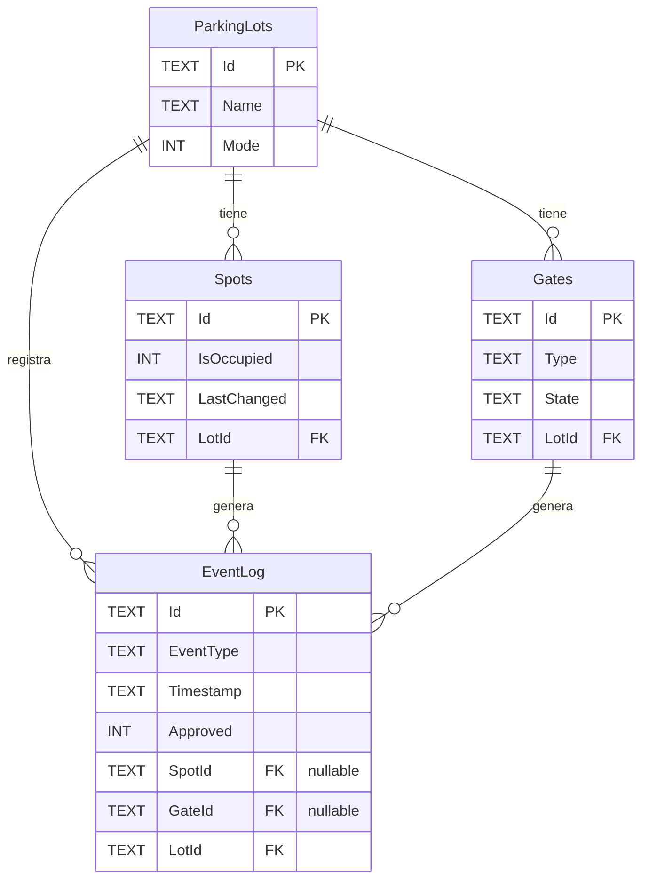

# Modelo Físico de Datos — Smart Parking Lot

Alcance final: **sin entidad Vehicle, sin VehiclePlate y sin integración de cámara**.
Las tres entidades centrales son `Spots`, `Gates` y un log unificado de eventos (`EventLog`).

### Fuera de alcance (explícitamente excluido)

| Componente eliminado | Razón |
|---|---|
| `ILicensePlateRecognizer` / `PlaceholderPlateRecognizer` | La integración de cámara LPR no forma parte del sistema final |
| `GateSensorReading.Plate` | No hay lectura de placa; el sensor de puerta solo detecta presencia |
| `VehiclePlate` en `Request`, `RequestLog` | Sin identificación de vehículo por placa |
| `SensorReadingLogs` / `DeviceActionLogs` / `AlertLogs` | Tablas auxiliares del hardware que no pertenecen al modelo de negocio final |
| Entidad `Vehicle` | No existe en el dominio |

---

## 1. Esquema conceptual

| Entidad | Descripción |
|---|---|
| `ParkingLots` | Estacionamiento (referencia, ya existe) |
| `Spots` | Cajón de aparcamiento con estado y timestamp de último cambio |
| `Gates` | Barrera/acceso; puede ser de entrada o salida |
| `EventLog` | Registro inmutable de todo evento de ocupación y de acceso |

---

## 2. DDL (SQLite — compatible con EF Core migrations)

Copiar y ejecutar en orden. Si ya existe la base en
`src/Cli/bin/Debug/net10.0/data/smartparkinglot.db`, abrir con
[DB Browser for SQLite](https://sqlitebrowser.org/) → pestaña "Execute SQL" y
pegar el bloque completo.

```sql
-- ──────────────────────────────────────────────
-- 0. Referencia: tabla ya existente (no recrear)
-- ──────────────────────────────────────────────
-- CREATE TABLE IF NOT EXISTS ParkingLots (
--     Id   TEXT NOT NULL PRIMARY KEY,
--     Name TEXT NOT NULL,
--     Mode INTEGER NOT NULL DEFAULT 0
-- );

-- ──────────────────────────────────────────────
-- 1. Spots
-- ──────────────────────────────────────────────
CREATE TABLE IF NOT EXISTS Spots (
    Id           TEXT    NOT NULL PRIMARY KEY,
    IsOccupied   INTEGER NOT NULL DEFAULT 0,      -- 0 = libre, 1 = ocupado
    LastChanged  TEXT    NOT NULL                 -- ISO-8601: '2026-06-02T10:30:00Z'
                         DEFAULT (strftime('%Y-%m-%dT%H:%M:%SZ', 'now')),
    LotId        TEXT    NOT NULL
                         REFERENCES ParkingLots(Id) ON DELETE CASCADE
);

CREATE INDEX IF NOT EXISTS idx_spots_lot       ON Spots(LotId);
CREATE INDEX IF NOT EXISTS idx_spots_occupied  ON Spots(IsOccupied);

-- ──────────────────────────────────────────────
-- 2. Gates
-- ──────────────────────────────────────────────
CREATE TABLE IF NOT EXISTS Gates (
    Id     TEXT NOT NULL PRIMARY KEY,
    Type   TEXT NOT NULL CHECK (Type IN ('ENTRY', 'EXIT', 'BOTH')),
    State  TEXT NOT NULL CHECK (State IN ('OPEN', 'CLOSED', 'FAULT'))
                 DEFAULT 'CLOSED',
    LotId  TEXT NOT NULL
                 REFERENCES ParkingLots(Id) ON DELETE CASCADE
);

CREATE INDEX IF NOT EXISTS idx_gates_lot    ON Gates(LotId);
CREATE INDEX IF NOT EXISTS idx_gates_state  ON Gates(State);

-- ──────────────────────────────────────────────
-- 3. EventLog  (ocupación + acceso, inmutable)
-- ──────────────────────────────────────────────
CREATE TABLE IF NOT EXISTS EventLog (
    Id         TEXT    NOT NULL PRIMARY KEY,
    EventType  TEXT    NOT NULL
                       CHECK (EventType IN ('OCCUPIED', 'RELEASED', 'ENTRY', 'EXIT')),
    Timestamp  TEXT    NOT NULL
                       DEFAULT (strftime('%Y-%m-%dT%H:%M:%SZ', 'now')),
    Approved   INTEGER,                -- NULL para eventos de ocupación
    SpotId     TEXT    REFERENCES Spots(Id) ON DELETE SET NULL,
    GateId     TEXT    REFERENCES Gates(Id) ON DELETE SET NULL,
    LotId      TEXT    NOT NULL
                       REFERENCES ParkingLots(Id) ON DELETE CASCADE,

    -- Al menos uno de SpotId o GateId debe estar presente
    CHECK (SpotId IS NOT NULL OR GateId IS NOT NULL)
);

CREATE INDEX IF NOT EXISTS idx_eventlog_lot       ON EventLog(LotId);
CREATE INDEX IF NOT EXISTS idx_eventlog_timestamp ON EventLog(Timestamp);
CREATE INDEX IF NOT EXISTS idx_eventlog_spot      ON EventLog(SpotId);
CREATE INDEX IF NOT EXISTS idx_eventlog_gate      ON EventLog(GateId);
```

### Datos semilla mínimos

```sql
-- Usar el lot ya sembrado por SeedInitialDataAsync (LOT-01)
INSERT OR IGNORE INTO Spots  VALUES ('S-01', 0, strftime('%Y-%m-%dT%H:%M:%SZ','now'), 'LOT-01');
INSERT OR IGNORE INTO Spots  VALUES ('S-02', 0, strftime('%Y-%m-%dT%H:%M:%SZ','now'), 'LOT-01');
INSERT OR IGNORE INTO Gates  VALUES ('G-01', 'ENTRY', 'CLOSED', 'LOT-01');
INSERT OR IGNORE INTO Gates  VALUES ('G-02', 'EXIT',  'CLOSED', 'LOT-01');
```

---

## 3. Diagrama del modelo físico (Mermaid ERD)

Pegar en cualquier renderer Mermaid (GitHub, [mermaid.live](https://mermaid.live),
Markdown Preview Enhanced en VS Code).



### Alternativa: dbdiagram.io (DBML)

Ir a <https://dbdiagram.io/d>, borrar el contenido y pegar:

```dbml
Table ParkingLots {
  Id   text [pk]
  Name text [not null]
  Mode int  [default: 0]
}

Table Spots {
  Id          text [pk]
  IsOccupied  int  [default: 0, note: '0=libre 1=ocupado']
  LastChanged text [not null]
  LotId       text [ref: > ParkingLots.Id]
}

Table Gates {
  Id    text [pk]
  Type  text [note: 'ENTRY | EXIT | BOTH']
  State text [note: 'OPEN | CLOSED | FAULT', default: 'CLOSED']
  LotId text [ref: > ParkingLots.Id]
}

Table EventLog {
  Id        text [pk]
  EventType text [note: 'OCCUPIED | RELEASED | ENTRY | EXIT']
  Timestamp text [not null]
  Approved  int  [note: 'NULL para eventos de ocupación']
  SpotId    text [ref: > Spots.Id]
  GateId    text [ref: > Gates.Id]
  LotId     text [ref: > ParkingLots.Id]
}
```

El diagrama se genera automáticamente y se puede exportar como PNG/PDF.

---

## 4. Pasos para aplicar el esquema al proyecto

### Opción A — Nueva migration EF Core (recomendada)

1. Agregar entidades `Spot`, `Gate` y `EventLog` en `src/Core/Entities/`.
2. Registrar los `DbSet<>` correspondientes en `ParkingLotDbContext`.
3. Configurar las propiedades con Fluent API en `OnModelCreating` (restricciones
   `CHECK` requieren `HasCheckConstraint`).
4. Desde la raíz del repo:

```powershell
dotnet ef migrations add AddSpotsGatesEventLog `
    --project src/Infrastructure `
    --startup-project src/Cli
dotnet ef database update `
    --project src/Infrastructure `
    --startup-project src/Cli
```

### Opción B — Ejecutar el DDL directamente (desarrollo rápido)

1. Abrir DB Browser for SQLite.
2. `File → Open Database` → seleccionar `smartparkinglot.db`.
3. Pestaña **Execute SQL** → pegar el bloque DDL de la sección 2 → `▶ Run`.
4. Verificar en la pestaña **Database Structure** que las tres tablas aparecen
   con sus índices.

---

## 5. Decisiones de diseño

| Decisión | Razón |
|---|---|
| `LastChanged` en `Spots` como TEXT ISO-8601 | SQLite no tiene tipo `DATETIME` nativo; TEXT con formato ISO permite ordenar con `ORDER BY` y comparar con `strftime`. |
| `EventLog` unificado (no dos tablas separadas) | El log es inmutable y se consulta siempre por rango de tiempo; una sola tabla evita JOINs y simplifica la API de consulta. |
| `CHECK` en `Type`/`State`/`EventType` | Validación en capa de datos, independiente del dominio, para detectar datos corruptos en herramientas externas. |
| FK con `ON DELETE CASCADE` | Si se elimina un `ParkingLot`, sus `Spots`, `Gates` y eventos se eliminan en cascada. Spots/Gates usan `SET NULL` en `EventLog` para preservar el histórico. |
| Sin columna `VehiclePlate` ni referencia a cámara | La integración LPR (cámara de reconocimiento de placas) fue descartada del alcance final. El log registra el evento (qué pasó, cuándo, en qué puerta/cajón), no el sujeto que lo provocó. |
