# Clases creadas en esta sesión

Diagrama agrupado por problema y tabla de uso en el codebase.

## Diagrama de clases

```mermaid
classDiagram
    %% ====== ACCESS POLICY (Strategy) ======
    class IAccessPolicy {
        <<interface>>
        +CanEnter(EntryRequest) bool
    }
    class AlwaysAllowPolicy
    class ScheduledBasedPolicy
    AlwaysAllowPolicy ..|> IAccessPolicy
    ScheduledBasedPolicy ..|> IAccessPolicy

    %% ====== LOGGING ======
    class ILogger {
        <<interface>>
        +Log(LogLevel, source, message)
    }
    class ConsoleLogger {
        +MinimumLevel
    }
    class FileLogger {
        +GetCurrentLogFilePath()
        +ListLogFiles()
    }
    class CompositeLogger
    ConsoleLogger ..|> ILogger
    FileLogger ..|> ILogger
    CompositeLogger ..|> ILogger
    CompositeLogger o-- ILogger : fan-out

    %% ====== DISPLAY ======
    class IDisplay {
        <<interface>>
        +ShowCapacity(avail, total)
        +ShowMessage(text)
    }
    class LcdDisplay
    LcdDisplay ..|> IDisplay

    %% ====== PLATE RECOGNITION (Strategy) ======
    class ILicensePlateRecognizer {
        <<interface>>
        +Recognize(gateId) string
    }
    class PlaceholderPlateRecognizer
    PlaceholderPlateRecognizer ..|> ILicensePlateRecognizer

    %% ====== REQUEST DISPATCHER (ISP) ======
    class IRequestDispatcher {
        <<interface>>
        +HandleRequest(Request)
    }
    class IGateRequestHandler {
        <<interface>>
        +CapacityService
        +AccessPolicy
        +Logger
        +OpenGate(id)
    }
    class GateController
    GateController ..|> IRequestDispatcher
    GateController ..|> IGateRequestHandler

    %% ====== EVENT HANDLERS ======
    class GateSensorHandler {
        +Handle(SensorReadingReceived)
    }
    GateSensorHandler --> IRequestDispatcher : dispatches Request
    GateSensorHandler --> ILicensePlateRecognizer : reads plate
    GateSensorHandler --> IDisplay : shows BIENVENIDO/LLENO/GRACIAS

    class LcdCapacityHandler {
        +Handle(SpotOccupancyChanged)
    }
    LcdCapacityHandler --> IDisplay : refresh capacity

    %% ====== HARDWARE GATE ======
    class Gate {
        -CTS autoCloseCts
        +Open()
        +Close()
    }
```



## Cómo se usa cada clase en el codebase

### Strategy: política de acceso

| Clase | Archivo | Para qué | Dónde se instancia | Quién la consume |
|---|---|---|---|---|
| `IAccessPolicy` | [src/Core/Interfaces/IAccessPolicy.cs](../src/Core/Interfaces/IAccessPolicy.cs) | Contrato Strategy: "¿se permite el ingreso?" sin atarlo a una regla concreta | — | [`EntryRequest.Execute`](../src/Core/Requests/EntryRequest.cs) lo consulta tras el chequeo de capacidad |
| `AlwaysAllowPolicy` | [src/Application/Policies/AlwaysAllowPolicy.cs](../src/Application/Policies/AlwaysAllowPolicy.cs) | Política trivial para demos / modo libre | [`ParkingLotApp`](../src/Cli/ParkingLotApp.cs) | Inyectada en `GateController` |
| `ScheduledBasedPolicy` | [src/Application/Policies/ScheduledBasedPolicy.cs](../src/Application/Policies/ScheduledBasedPolicy.cs) | Sólo permite entrada en una franja horaria | (Disponible para swap en Composition Root) | Inyectada en `GateController` |

### Logging

| Clase | Archivo | Para qué | Dónde se instancia | Quién la consume |
|---|---|---|---|---|
| `ILogger` | [src/Core/Interfaces/ILogger.cs](../src/Core/Interfaces/ILogger.cs) | Contrato unificado para registrar mensajes | — | Todos los servicios y entidades de comportamiento |
| `LoggerExtensions` | [src/Core/Interfaces/LoggerExtensions.cs](../src/Core/Interfaces/LoggerExtensions.cs) | Métodos `Info/Warn/Error/Debug` sobre `ILogger` para call sites limpios | — | Sites de logging en todo el codebase |
| `ConsoleLogger` | [src/Application/Logging/ConsoleLogger.cs](../src/Application/Logging/ConsoleLogger.cs) | Imprime con timestamp + nivel; `MinimumLevel` mutable para "monitoreo en vivo" | [`ParkingLotApp`](../src/Cli/ParkingLotApp.cs) | Pasa a `ConsoleMenu` para subir/bajar nivel en opción 8 |
| `FileLogger` | [src/Application/Logging/FileLogger.cs](../src/Application/Logging/FileLogger.cs) | Persiste logs a archivo diario; `lock` interno para thread-safety | [`ParkingLotApp`](../src/Cli/ParkingLotApp.cs) | `ConsoleMenu.ShowRecentLogs` lee del path que expone |
| `CompositeLogger` | [src/Application/Logging/CompositeLogger.cs](../src/Application/Logging/CompositeLogger.cs) | Patrón Composite — fan-out a múltiples loggers | [`ParkingLotApp`](../src/Cli/ParkingLotApp.cs) | Inyectado como `ILogger` a todo el grafo: services, hardware, requests, persistence |

### Display

| Clase | Archivo | Para qué | Dónde se instancia | Quién la consume |
|---|---|---|---|---|
| `IDisplay` | [src/Core/Interfaces/IDisplay.cs](../src/Core/Interfaces/IDisplay.cs) | Abstracción de pantalla: capacidad + mensajes | — | `GateSensorHandler` y `LcdCapacityHandler` |
| `LcdDisplay` | [src/Application/Display/LcdDisplay.cs](../src/Application/Display/LcdDisplay.cs) | Implementación que traduce a `ActuatorCommand` y despacha al Arduino vía `ICommandDispatcher` | [`ParkingLotApp`](../src/Cli/ParkingLotApp.cs) | Inyectada como `IDisplay` |

### Reconocimiento de placa

| Clase | Archivo | Para qué | Dónde se instancia | Quién la consume |
|---|---|---|---|---|
| `ILicensePlateRecognizer` | [src/Core/Interfaces/ILicensePlateRecognizer.cs](../src/Core/Interfaces/ILicensePlateRecognizer.cs) | Strategy: "dame la placa que disparó la puerta X" | — | `GateSensorHandler` cuando un IR de puerta se activa |
| `PlaceholderPlateRecognizer` | [src/Application/Recognition/PlaceholderPlateRecognizer.cs](../src/Application/Recognition/PlaceholderPlateRecognizer.cs) | Stub temporal `AUTO-{ts}` hasta integrar OV7670+OCR | [`ParkingLotApp`](../src/Cli/ParkingLotApp.cs) | Inyectada como `ILicensePlateRecognizer` (a reemplazar por `Ov7670PlateRecognizer` cuando se integren cámaras — ver `docs/camera-integration-plan.md`) |

### Dispatcher (ISP)

| Clase | Archivo | Para qué | Dónde se instancia | Quién la consume |
|---|---|---|---|---|
| `IRequestDispatcher` | [src/Core/Interfaces/IRequestDispatcher.cs](../src/Core/Interfaces/IRequestDispatcher.cs) | Sólo `HandleRequest(Request)` — el rol de "punto de entrada externo" del controller | — | `GateSensorHandler` (en vez de depender del concreto `GateController`) |
| `GateController` (modificado) | [src/Application/Controllers/GateController.cs](../src/Application/Controllers/GateController.cs) | Implementa **ambas** interfaces: `IRequestDispatcher` (hacia afuera) e `IGateRequestHandler` (hacia los `Request.Execute`) | [`ParkingLotApp`](../src/Cli/ParkingLotApp.cs) | `ConsoleMenu` (dependencia concreta), `GateSensorHandler` (a través de `IRequestDispatcher`) |

### Handlers de eventos

| Clase | Archivo | Para qué | Dónde se instancia | Quién la consume |
|---|---|---|---|---|
| `GateSensorHandler` | [src/Application/Handlers/GateSensorHandler.cs](../src/Application/Handlers/GateSensorHandler.cs) | Suscribe a `SensorReadingReceived`; cuando llega de un IR de puerta, construye `EntryRequest`/`ExitRequest` y muestra mensaje en LCD | [`ParkingLotApp`](../src/Cli/ParkingLotApp.cs) | El bus (`InProcessEventBus.Subscribe`) lo invoca |
| `LcdCapacityHandler` | [src/Application/Handlers/LcdCapacityHandler.cs](../src/Application/Handlers/LcdCapacityHandler.cs) | Suscribe a `SpotOccupancyChanged`; cada cambio refresca `IDisplay.ShowCapacity` | [`ParkingLotApp`](../src/Cli/ParkingLotApp.cs) | Se conecta al evento `OccupancyChanged` de cada `ParkingSpot` |

### Hardware refactorizado

| Clase | Archivo | Para qué | Dónde se instancia | Quién la consume |
|---|---|---|---|---|
| `Gate` | [src/Hardware/Gate.cs](../src/Hardware/Gate.cs) | Inyecta `ICommandDispatcher` + `actuatorId`; despacha `ANGLE` al Arduino y programa auto-cierre con `CancellationTokenSource` (cancela el pendiente al re-abrir) | [`ParkingLotApp`](../src/Cli/ParkingLotApp.cs) | Registrado en `GateController.RegisterGate(...)` |

## Flujo end-to-end (todas las piezas en acción)

```
Vehículo cruza el sensor de la puerta de entrada
   │
   ▼ EVT:SENSOR:GATE-IR1:1  (Arduino → serial)
ArduinoSerialBridge → publica SensorReadingReceived al bus
   │
   ▼ bus invoca handlers suscritos
GateSensorHandler.Handle(evt)
   │
   ├─ ILicensePlateRecognizer.Recognize(G-01) → "AUTO-..."
   │
   ├─ IRequestDispatcher.HandleRequest(EntryRequest)
   │      │
   │      ▼ EntryRequest.Execute(handler as IGateRequestHandler)
   │      ├─ handler.CapacityService.HasAvailableSpots() → true
   │      ├─ handler.AccessPolicy.CanEnter(this) → true
   │      ├─ handler.CapacityService.ReserveSpot() → spot
   │      └─ handler.OpenGate(G-01)
   │              │
   │              ▼ Gate.Open()
   │              ├─ DispatchAngle(MAX_ANGLE) → Arduino mueve servo
   │              ├─ ScheduleAutoClose() → CTS, Task.Delay(5s)
   │              └─ Logger.Info(">>> PUERTA ABIERTA <<<")
   │
   └─ IDisplay.ShowMessage("BIENVENIDO")
          │
          ▼ LcdDisplay → ActuatorCommand("LCD","MSG","BIENVENIDO")
          ▼ Arduino muestra "BIENVENIDO" 3s en LCD

5 segundos después:
   AutoCloseAsync awaits Task.Delay y luego DispatchAngle(MIN_ANGLE)
   Arduino cierra el servo
   Logger.Info("<<< PUERTA CERRADA >>>")

ReserveSpot disparó ParkingSpot.OccupancyChanged → LcdCapacityHandler.Handle
   IDisplay.ShowCapacity(2, 3) → LCD actualiza "Libres: 2/3"
```
