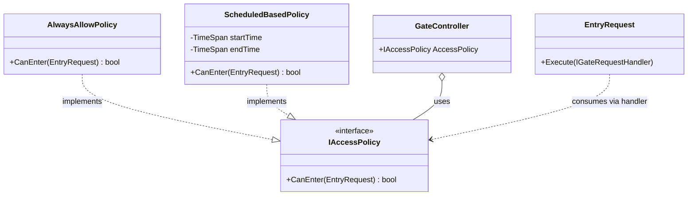

# Sustentación — Patrón Strategy en Smart Parking Lot

## El ejemplo principal: `IAccessPolicy`

Es el caso pedagógicamente más limpio. Dos implementaciones distintas, intercambiables en runtime, sin que el cliente sepa cuál tiene.

### Diagrama UML para mostrar



---

## Los 5 fragmentos de código que mostrar (en este orden)

### Fragmento 1 — La interfaz Strategy (el contrato)

📄 [src/Core/Interfaces/IAccessPolicy.cs](../src/Core/Interfaces/IAccessPolicy.cs)

```csharp
namespace SmartParkingLot.Core.Interfaces;

public interface IAccessPolicy
{
    bool CanEnter(EntryRequest request);
}
```

**Qué decir:**
> "Acá defino el contrato Strategy: una sola pregunta, `¿este vehículo puede entrar?`. La interfaz no sabe nada de capacidad ni horarios — eso lo decide cada implementación concreta."

---

### Fragmento 2 — Estrategia concreta A (la simple)

📄 [src/Application/Policies/AlwaysAllowPolicy.cs](../src/Application/Policies/AlwaysAllowPolicy.cs)

```csharp
public class AlwaysAllowPolicy : IAccessPolicy
{
    public bool CanEnter(EntryRequest request) => true;
}
```

**Qué decir:**
> "La política más simple: siempre permite. Útil para demos o modo libre. Lo importante: implementa la misma interfaz."

---

### Fragmento 3 — Estrategia concreta B (con estado)

📄 [src/Application/Policies/ScheduledBasedPolicy.cs](../src/Application/Policies/ScheduledBasedPolicy.cs)

```csharp
public class ScheduledBasedPolicy : IAccessPolicy
{
    private readonly TimeSpan _startTime;
    private readonly TimeSpan _endTime;

    public ScheduledBasedPolicy(TimeSpan startTime, TimeSpan endTime)
    {
        _startTime = startTime;
        _endTime = endTime;
    }

    public bool CanEnter(EntryRequest request)
    {
        var currentTime = DateTime.Now.TimeOfDay;
        return currentTime >= _startTime && currentTime <= _endTime;
    }
}
```

**Qué decir:**
> "Una segunda estrategia con estado propio (las horas de operación). Demuestra que cada estrategia puede tener sus propios datos y lógica internos sin afectar al cliente. La firma del método es idéntica a la otra estrategia — eso es lo que las hace intercambiables."

---

### Fragmento 4 — El cliente (no sabe qué política tiene)

📄 [src/Core/Requests/EntryRequest.cs](../src/Core/Requests/EntryRequest.cs) (líneas 14-30)

```csharp
public override void Execute(IGateRequestHandler handler)
{
    handler.Logger.Log(LogLevel.Info, LogSource,
        $"Solicitud recibida: Vehículo '{VehiclePlate}' a las {Timestamp:HH:mm:ss}");

    if (!handler.CapacityService.HasAvailableSpots())
    {
        // ...rechazar por capacidad
        return;
    }

    if (!handler.AccessPolicy.CanEnter(this))   // ← USO DE LA STRATEGY
    {
        Approved = false;
        handler.AlertService.GenerateAlert(new GateSensorReading(VehiclePlate, GateId));
        handler.Logger.Log(LogLevel.Warning, LogSource,
            $"Política de acceso rechazó el ingreso de {VehiclePlate}");
        return;
    }

    // ...reservar y abrir puerta
}
```

**Qué decir:**
> "Acá está el cliente — `EntryRequest`. Llama a `handler.AccessPolicy.CanEnter(this)` sin saber **qué** política tiene asignada. Mañana se puede agregar una `BlacklistPolicy` o una `VipOnlyPolicy` y este código **no se modifica**. Eso es el principio Open/Closed: abierto a extensión, cerrado a modificación."

---

### Fragmento 5 — La selección en runtime (Composition Root)

📄 [src/Cli/ParkingLotApp.cs](../src/Cli/ParkingLotApp.cs) (línea ~92)

```csharp
// Acá se decide qué estrategia usa el sistema, en un solo punto.
IAccessPolicy accessPolicy = new AlwaysAllowPolicy();

// Para cambiar a horario de operación, basta modificar esta línea:
// IAccessPolicy accessPolicy = new ScheduledBasedPolicy(
//     TimeSpan.FromHours(7), TimeSpan.FromHours(22));

var gateController = new GateController(
    capacityService, alertService, accessPolicy, logger);
```

**Qué decir:**
> "El Composition Root es el único lugar de toda la aplicación que conoce las clases concretas. Cambiar la regla del parqueadero entero es cambiar **una línea**. El resto del sistema — `EntryRequest`, `GateController`, los handlers — ni se entera."

---

## El argumento clave para la sustentación

> *"Strategy nos permite que el sistema sea agnóstico a la regla de negocio.
> El parqueadero hoy permite todo, mañana puede operar sólo de 7 a 22, pasado mañana puede tener una lista negra de placas — y el código de `EntryRequest` no cambia ni una línea. Eso es Strategy bien aplicado: encapsular un algoritmo intercambiable detrás de una abstracción común."*

### Tres beneficios concretos a remarcar

1. **Open/Closed Principle**: agregar una nueva política no requiere tocar las existentes ni el cliente.
2. **Dependency Inversion**: `EntryRequest` y `GateController` dependen de la abstracción `IAccessPolicy`, no de implementaciones concretas.
3. **Testabilidad**: en un test puedo inyectar un `Mock<IAccessPolicy>` que devuelva `true` o `false` a voluntad sin levantar todo el sistema.

---

## Bonus — segundo ejemplo de Strategy (si te alcanza el tiempo)

El sistema tiene **otro Strategy bien implementado** que vale mencionar al pasar: `ILogger`.

```csharp
public interface ILogger
{
    void Log(LogLevel level, string source, string message);
}

// Implementaciones intercambiables:
public class ConsoleLogger : ILogger { ... }
public class FileLogger    : ILogger { ... }
public class CompositeLogger : ILogger { ... }   // ← además es Composite
```

**Cómo introducirlo:**
> "El mismo patrón se aplica en otra parte del sistema: `ILogger`. Tenemos `ConsoleLogger`, `FileLogger`, y un `CompositeLogger` que combina varios. El sistema entero loguea contra `ILogger` sin saber a dónde van los mensajes. En el Composition Root decidimos: a consola, a archivo, o a ambos. Mismo patrón, dominio distinto."

`CompositeLogger` es bonus: es **Strategy + Composite** combinados — implementa la misma interfaz que sus hijos y los compone.

---

## Anti-patrón que evitamos (útil para responder preguntas)

Si te preguntan **"¿por qué no un `if/else` con un enum?"**, este sería el contra-ejemplo:

```csharp
// MAL — esto NO es Strategy:
if (config.Mode == ParkingMode.AlwaysOpen)
    approved = true;
else if (config.Mode == ParkingMode.Scheduled)
    approved = (DateTime.Now.TimeOfDay >= start && DateTime.Now.TimeOfDay <= end);
else if (config.Mode == ParkingMode.Blacklist)
    approved = !blacklist.Contains(plate);
// ... cada nueva regla agrega un branch
```

**Problemas:**
- Cada nueva regla obliga a modificar `EntryRequest` (rompe Open/Closed).
- La lógica del horario se mezcla con la lógica del flujo de entrada (rompe High Cohesion).
- No se puede componer (ej. capacidad + horario + lista negra a la vez).
- Imposible testear cada regla aisladamente.

Strategy resuelve los cuatro.

---

## Preguntas anticipadas

| Pregunta | Respuesta corta |
|---|---|
| "¿Por qué Strategy y no Template Method?" | Template Method requiere herencia y comparte código entre estrategias. Acá las estrategias son independientes y no comparten ninguna parte del algoritmo. |
| "¿Por qué pasaron `EntryRequest` como parámetro?" | Para que estrategias futuras puedan inspeccionar la placa, el gateId, el timestamp, etc. (ej. `BlacklistPolicy` necesita la placa). |
| "¿Y si necesitan combinar políticas?" | Patrón Composite: un `CompositeAccessPolicy` que recibe varias y aplica AND. Como `IAccessPolicy` es uniforme, el composite también la implementa. |
| "¿Por qué `CapacityService` no es una política?" | Porque la capacidad es un **hecho físico** del parqueadero, no una regla configurable. Lo discutimos antes de implementar — políticas son reglas de negocio intercambiables; cupo no lo es. |

---

## Checklist para el día

- [ ] Tener abierto `IAccessPolicy.cs`, `AlwaysAllowPolicy.cs`, `ScheduledBasedPolicy.cs`, `EntryRequest.cs` y `ParkingLotApp.cs` en pestañas adyacentes.
- [ ] Tener el diagrama Mermaid renderizado (preview en VSCode o exportado a imagen).
- [ ] Demostración en vivo: cambiar la línea en `ParkingLotApp.cs` de `AlwaysAllowPolicy` a `ScheduledBasedPolicy(TimeSpan.FromHours(0), TimeSpan.FromHours(0))` (rango imposible) → recompilar → mostrar que la app rechaza ingresos sin que se haya tocado nada más.
- [ ] Prepará la respuesta del anti-patrón por si te preguntan.
